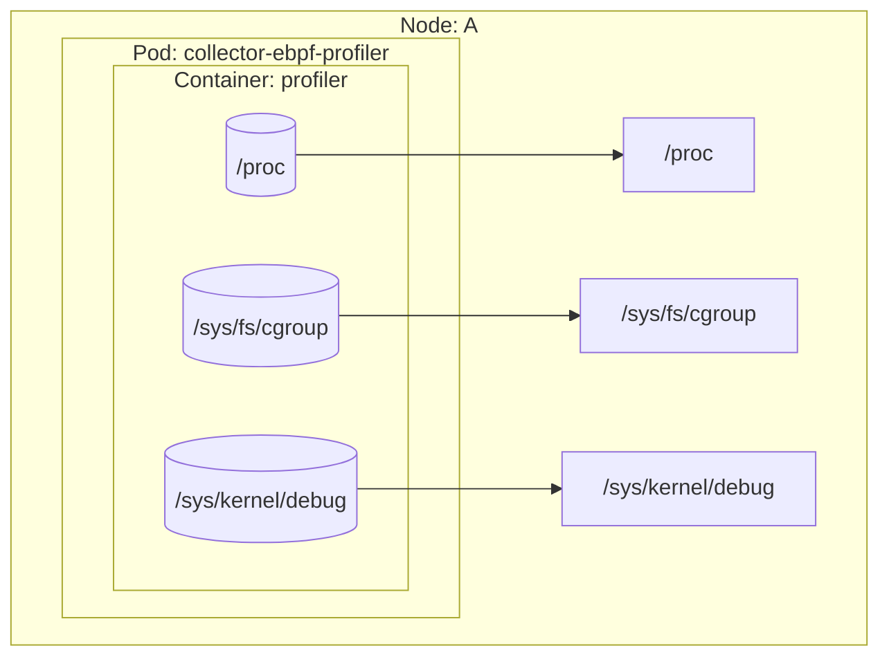

# OpenTelemetry Collector eBPF Profiling Distribution

[](https://github.com/danielpacak/opentelemetry-collector-ebpf-profiler/actions/workflows/docker-publish.yaml)
![Docker Pulls][docker-pulls]

This OpenTelemetry Collector distribution is made specifically to be used as a node agent to gather
profiles on all processes running on the system. It contains the [eBPF profiler receiver] as well as
a subset of components from OpenTelemetry Collector Core and OpenTelemetry Collector Contrib.

> The purpose of this repository is not to replace the official OpenTelemetry Collector eBPF
> Profiling Distribution, but to play with an early, custom distribution until the upstream is
> officially released.

## Quick Start

1. Create a collector configuration file. A very basic configuration may look as follows:

   ``` yaml
   # collector-config.yaml
   receivers:
     profiling:
       Tracers: "perl,php,python,hotspot,ruby,v8,dotnet,go"
       SamplesPerSecond: 20
       BpfVerifierLogLevel: 1
       VerboseMode: true
       SendErrorFrames: false
       OffCPUThreshold: 0
     customprofilesreceiver:
       report_interval: 5s

   processors:
     customprofilesexporter:
       foo: "bar"

   exporters:
     customprofilesexporter:
       ignore_profiles_without_container_id: true
       export_resource_attributes: true
       export_profile_attributes: true
       export_sample_attributes: true
       export_stack_frames: true
       export_stack_frame_types:
         - native
         - kernel
         - go
         - jvm
         - php
         - cpython

   service:
     pipelines:
       profiles:
         receivers:
           - profiling
           - customprofilesreceiver
         processors:
           - customprofilesexporter
         exporters:
           - customprofilesexporter
   ```
2. Create and run collector in a new container from the image that has already been published to the
   Docker Hub container image library:

   ```
   docker run --name collector-ebpf-profiling-distro --privileged --pid=host -it --rm \
     -v /sys/kernel/debug:/sys/kernel/debug \
     -v /sys/fs/cgroup:/sys/fs/cgroup \
     -v /proc:/proc \
     -v $PWD/collector-config.yaml:/etc/config.yaml \
     -p 4317:4317 -p 4318:4318 \
     docker.io/danielpacak/opentelemetry-collector-ebpf-profiler:latest \
       --config=/etc/config.yaml \
       --feature-gates=service.profilesSupport
   ```

## Example Kubernetes Deployment

For Kubernetes deployment it's possible to add the [k8sattributes] processor to the profiles
pipeline. The processor will enrich profiles with Kubernetes metadata by associating them with pods
through the `container.id` resource attribute.

``` yaml
# collector-config.yaml
receivers:
  profiling:
    Tracers: "perl,php,python,hotspot,ruby,v8,dotnet,go"
    SamplesPerSecond: 20
    BpfVerifierLogLevel: 1
    VerboseMode: true
    SendErrorFrames: false
    OffCPUThreshold: 0

processors:
  k8sattributes:
    wait_for_metadata: true
    wait_for_metadata_timeout: 10s
    auth_type: "serviceAccount"
    passthrough: false
    filter:
      node_from_env_var: KUBERNETES_NODE_NAME
    extract:
      metadata:
        - k8s.container.name
        - k8s.pod.name
        - k8s.pod.uid
        - k8s.deployment.name
        - k8s.namespace.name
        - service.namespace
        - service.name
        - service.version
        - service.instance.id
        - container.image.name
        - container.image.tag
        - container.image.repo_digests
      labels:
        - tag_name: app.label.component
          key: app.kubernetes.io/component
          from: pod
      otel_annotations: true
    pod_association:
      - sources:
          - from: resource_attribute
            name: container.id

exporters:
  customprofilesexporter:
    ignore_profiles_without_container_id: true
    export_resource_attributes: true
    export_profile_attributes: true
    export_sample_attributes: true
    export_stack_frames: true
    export_stack_frame_types:
      - native
      - kernel
      - go
      - jvm
      - php
      - cpython

service:
  pipelines:
    profiles:
      receivers:
        - profiling
      processors:
        - k8sattributes
      exporters:
        - customprofilesexporter

```

```
kubectl apply -f example/kubernetes/node-agent.yaml
```

``` console
$ kubectl logs -n node-agent daemonsets/collector-ebpf-profiler
------------------- New Resource -----------------
  container.id: e5db738b79589d83a5cf6aec3eeb14f6e63c5a15cdba0cb58712a440d523277c
  k8s.pod.name: kube-apiserver-kube-control-plane
  service.name: kube-apiserver-kube-control-plane
  k8s.namespace.name: kube-system
  k8s.pod.uid: 34644f56-714b-46f5-baef-36eaf447bbd9
  service.instance.id: kube-system.kube-apiserver-kube-control-plane.kube-apiserver
  service.version: v1.32.5
  service.namespace: kube-system
---------------------------------------------------
------------------- New Profile -------------------
  ProfileID: 00000000000000000000000000000000
  Dropped attributes count: 0
  SampleType: samples
------------------- New Sample --------------------
  thread.name: kube-apiserver
  process.executable.name: kube-apiserver
  process.executable.path: /usr/local/bin/kube-apiserver
  process.pid: 2853
  thread.id: 2925
---------------------------------------------------
Instrumentation: go, Function: crypto/internal/bigmod.addMulVVW1024, File: crypto/internal/bigmod/nat_amd64.s, Line: 221, Column: 0
Instrumentation: go, Function: crypto/internal/bigmod.(*Nat).montgomeryMul, File: crypto/internal/bigmod/nat.go, Line: 653, Column: 0
Instrumentation: go, Function: crypto/internal/bigmod.(*Nat).Exp, File: crypto/internal/bigmod/nat.go, Line: 756, Column: 0
Instrumentation: go, Function: crypto/rsa.decrypt, File: crypto/rsa/rsa.go, Line: 676, Column: 0
Instrumentation: go, Function: crypto/rsa.signPSSWithSalt, File: crypto/rsa/pss.go, Line: 244, Column: 0
Instrumentation: go, Function: crypto/rsa.SignPSS, File: crypto/rsa/pss.go, Line: 332, Column: 0
Instrumentation: go, Function: crypto/rsa.(*PrivateKey).Sign, File: crypto/rsa/rsa.go, Line: 165, Column: 0
Instrumentation: go, Function: crypto/tls.(*serverHandshakeStateTLS13).sendServerCertificate, File: crypto/tls/handshake_server_tls13.go, Line: 755, Column: 0
Instrumentation: go, Function: crypto/tls.(*serverHandshakeStateTLS13).handshake, File: crypto/tls/handshake_server_tls13.go, Line: 68, Column: 0
Instrumentation: go, Function: crypto/tls.(*Conn).serverHandshake, File: crypto/tls/handshake_server.go, Line: 54, Column: 0
Instrumentation: go, Function: crypto/tls.(*Conn).serverHandshake-fm, File: <autogenerated>, Line: 1, Column: 0
Instrumentation: go, Function: crypto/tls.(*Conn).handshakeContext, File: crypto/tls/conn.go, Line: 1568, Column: 0
Instrumentation: go, Function: net/http.(*conn).serve, File: crypto/tls/conn.go, Line: 1508, Column: 0
Instrumentation: go, Function: net/http.(*Server).Serve.gowrap3, File: net/http/server.go, Line: 3360, Column: 0
Instrumentation: go, Function: runtime.goexit, File: runtime/asm_amd64.s, Line: 1701, Column: 0
------------------- End Sample --------------------
------------------- New Sample --------------------
  thread.name: kube-apiserver
  process.executable.name: kube-apiserver
  process.executable.path: /usr/local/bin/kube-apiserver
  process.pid: 2853
  thread.id: 2905
---------------------------------------------------
Instrumentation: kernel, Function: finish_task_switch.isra.0, File: , Line: 0, Column: 0
Instrumentation: kernel, Function: __schedule, File: , Line: 0, Column: 0
Instrumentation: kernel, Function: schedule, File: , Line: 0, Column: 0
Instrumentation: kernel, Function: futex_wait_queue, File: , Line: 0, Column: 0
Instrumentation: kernel, Function: __futex_wait, File: , Line: 0, Column: 0
Instrumentation: kernel, Function: futex_wait, File: , Line: 0, Column: 0
Instrumentation: kernel, Function: do_futex, File: , Line: 0, Column: 0
Instrumentation: kernel, Function: __x64_sys_futex, File: , Line: 0, Column: 0
Instrumentation: kernel, Function: x64_sys_call, File: , Line: 0, Column: 0
Instrumentation: kernel, Function: do_syscall_64, File: , Line: 0, Column: 0
Instrumentation: kernel, Function: entry_SYSCALL_64_after_hwframe, File: , Line: 0, Column: 0
Instrumentation: go, Function: runtime.futex, File: runtime/sys_linux_amd64.s, Line: 558, Column: 0
Instrumentation: go, Function: runtime.futexsleep, File: runtime/os_linux.go, Line: 69, Column: 0
Instrumentation: go, Function: runtime.notesleep, File: runtime/lock_futex.go, Line: 171, Column: 0
Instrumentation: go, Function: runtime.stopm, File: runtime/proc.go, Line: 1867, Column: 0
Instrumentation: go, Function: runtime.findRunnable, File: runtime/proc.go, Line: 3258, Column: 0
Instrumentation: go, Function: runtime.schedule, File: runtime/proc.go, Line: 3996, Column: 0
Instrumentation: go, Function: runtime.park_m, File: runtime/proc.go, Line: 4104, Column: 0
Instrumentation: go, Function: runtime.mcall, File: runtime/asm_amd64.s, Line: 463, Column: 0
------------------- End Sample --------------------
------------------- End Profile -------------------
------------------- End Resource ------------------
```




## Example Docker Compose Deployment

```
cd example/docker
docker compose up -d
```

Pyroscope is accessible at http://localhost:4040 and Grafana at http://localhost:3000. Grafana is
provisioned with the Pyroscope datasource so you can either see profiles in Pyroscope web UI or with
Grafana's Pyroscope application.

```
docker compose down
```

---

## Building and Running Locally


1. Install the builder. For linux/amd64 platform you can use the following command:

   ```
   curl --proto '=https' --tlsv1.2 -fL -o ocb \
   https://github.com/open-telemetry/opentelemetry-collector-releases/releases/download/cmd%2Fbuilder%2Fv0.134.0/ocb_0.134.0_linux_amd64
   chmod +x ocb
   ```

2. Generate the code and build Collector's distribution:

   ```
   ./ocb --config manifest.yaml
   ```

3. Containerize Collector’s distribution:
   1. Enable Docker multi-arch builds:
      ```
      docker run --rm --privileged tonistiigi/binfmt --install all
      docker buildx create --name mybuilder --use
      ```
   2. Build the Docker image as Linux AMD and ARM, and load the build result to "docker images":
      ```
      docker buildx build --load \
        -t docker.io/danielpacak/opentelemetry-collector-ebpf-profiler:latest \
        --platform=linux/amd64,linux/arm64 .
      ```
   3. Test the newly-built image:
      ```
      docker run --name collector-ebpf-profiling-distro --privileged --pid=host -it --rm \
        -v /sys/kernel/debug:/sys/kernel/debug \
        -v /sys/fs/cgroup:/sys/fs/cgroup \
        -v /proc:/proc \
        -v $PWD/collector-config.yaml:/etc/config.yaml \
        -p 4317:4317 -p 4318:4318 \
        docker.io/danielpacak/opentelemetry-collector-ebpf-profiler:latest \
          --config=/etc/config.yaml \
          --feature-gates=service.profilesSupport
      ```

## Further Reading

1. https://opentelemetry.io/docs/collector/distributions/
2. https://github.com/open-telemetry/opentelemetry-collector-releases/tree/main/distributions/otelcol-ebpf-profiler
3. https://github.com/open-telemetry/opentelemetry-ebpf-profiler/issues/521
4. https://opentelemetry.io/docs/collector/custom-collector/
5. https://blog.jaimyn.dev/how-to-build-multi-architecture-docker-images-on-an-m1-mac/
6. https://github.com/grafana/pyroscope/blob/main/examples/grafana-alloy-auto-instrumentation/ebpf-otel/docker/docker-compose.yml
7. https://github.com/open-telemetry/opentelemetry-collector-contrib/blob/main/processor/k8sattributesprocessor/README.md

[eBPF profiler receiver]: https://github.com/open-telemetry/opentelemetry-ebpf-profiler

[k8sattributes]: https://github.com/open-telemetry/opentelemetry-collector-contrib/blob/main/processor/k8sattributesprocessor/README.md


[docker-pulls]: https://img.shields.io/docker/pulls/danielpacak/opentelemetry-collector-ebpf-profiler?logo=docker&label=Docker%20Hub%20Pulls
