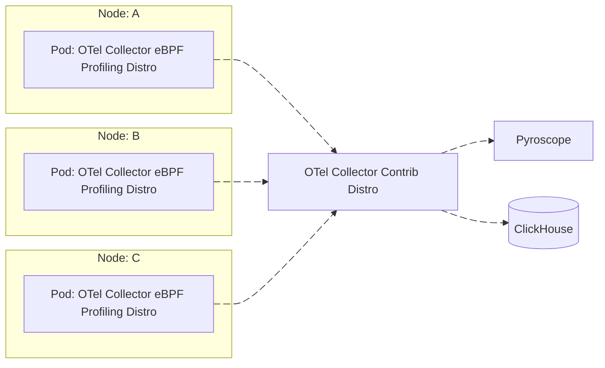
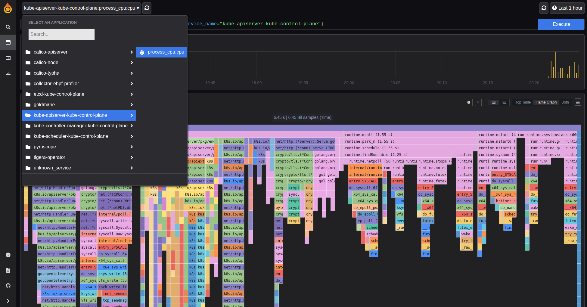

# OpenTelemetry Collector eBPF Profiling Distribution

[](https://github.com/danielpacak/opentelemetry-collector-ebpf-profiler/actions/workflows/docker-publish.yaml)
![Docker Pulls][docker-pulls]

This OpenTelemetry Collector distribution is made specifically to be used as a node agent to gather
profiles on all processes running on the system. It contains the [eBPF profiler receiver] as well as
a subset of components from OpenTelemetry Collector Core and OpenTelemetry Collector Contrib.

> The purpose of this repository is not to replace the official OpenTelemetry Collector eBPF
> Profiling [Distribution](https://github.com/open-telemetry/opentelemetry-collector-releases/tree/main/distributions/otelcol-ebpf-profiler),
> but to play with an early, custom distribution until the upstream is officially released.

## Deployment



## Quick Start

1. Create a collector configuration file. A very basic configuration may look as follows:

   ``` yaml
   # collector-config.yaml
   receivers:
     profiling:
       Tracers: "perl,php,python,hotspot,ruby,v8,dotnet,go"
       SamplesPerSecond: 20
     customprofilesreceiver:
       report_interval: 5s

   processors:
     customprofilesexporter:
       foo: "bar"

   exporters:
     customprofilesexporter:
       ignore_profiles_without_container_id: true
       export_resource_attributes: true
       export_profile_attributes: true
       export_sample_attributes: true
       export_stack_frames: true
       export_stack_frame_types:
         - native
         - kernel
         - go
         - jvm
         - php
         - cpython
       export_function_file: true

   service:
     pipelines:
       profiles:
         receivers:
           - profiling
           - customprofilesreceiver
         processors:
           - customprofilesexporter
         exporters:
           - customprofilesexporter
   ```
2. Create and run collector in a new container from the image that has already been published to the
   Docker Hub container image library:

   ```
   docker run --name collector-ebpf-profiling-distro --privileged --pid=host -it --rm \
     -v /sys/kernel/debug:/sys/kernel/debug \
     -v /sys/fs/cgroup:/sys/fs/cgroup \
     -v /proc:/proc \
     -v $PWD/collector-config.yaml:/etc/config.yaml \
     -p 4317:4317 -p 4318:4318 \
     docker.io/danielpacak/opentelemetry-collector-ebpf-profiler:latest \
       --config=/etc/config.yaml \
       --feature-gates=service.profilesSupport
   ```

## Example Kubernetes Deployments

### Simple

For Kubernetes deployment it's possible to add the [Kubernetes Attributes Processor] to the profiles
pipeline. The processor will enrich profiles with Kubernetes metadata by associating them with pods
through the `container.id` resource attribute.

``` yaml
# collector-config.yaml
receivers:
  profiling:
    Tracers: "perl,php,python,hotspot,ruby,v8,dotnet,go"
    SamplesPerSecond: 20

processors:
  k8sattributes:
    wait_for_metadata: true
    wait_for_metadata_timeout: 10s
    auth_type: "serviceAccount"
    passthrough: false
    filter:
      node_from_env_var: KUBERNETES_NODE_NAME
    extract:
      metadata:
        - k8s.cluster.uid
        - k8s.node.name
        - k8s.pod.uid
        - k8s.pod.name
        - k8s.container.name
        - k8s.deployment.name
        - k8s.namespace.name
        - service.namespace
        - service.name
        - service.version
        - service.instance.id
        - container.image.name
        - container.image.tag
        - container.image.repo_digests
      otel_annotations: true
    pod_association:
      - sources:
          - from: resource_attribute
            name: container.id

exporters:
  customprofilesexporter:
    ignore_profiles_without_container_id: true
    export_resource_attributes: true
    export_profile_attributes: true
    export_sample_attributes: true
    export_stack_frames: true
    export_stack_frame_types:
      - native
      - kernel
      - go
      - jvm
      - php
      - cpython

extensions:
  pprof:
    endpoint: ":1777"

service:
  extensions:
    - pprof
  pipelines:
    profiles:
      receivers:
        - profiling
      processors:
        - k8sattributes
      exporters:
        - customprofilesexporter
```

```
kubectl apply -k example/kubernetes/simple
```

``` console
$ kubectl logs -n node-agent daemonsets/collector-ebpf-profiler
--------------- New Resource Profile --------------
  container.id: cb8ebdde43ea93f184b41d77695ae90411f952e7850c4a37f42408de78b8faa4 (Str)
  k8s.pod.name: kube-apiserver-kube-control-plane (Str)
  service.name: kube-apiserver-kube-control-plane (Str)
  k8s.namespace.name: kube-system (Str)
  service.namespace: kube-system (Str)
  k8s.pod.uid: 2f9000e3-f733-4dfe-917e-c12b1627d186 (Str)
  k8s.node.name: kube-control-plane (Str)
  k8s.cluster.uid: 55383944-1970-45b5-a24e-ae178dc09578 (Str)
  k8s.container.name: kube-apiserver (Str)
  container.image.name: registry.k8s.io/kube-apiserver (Str)
  container.image.tag: v1.32.7 (Str)
  service.instance.id: kube-system.kube-apiserver-kube-control-plane.kube-apiserver (Str)
  service.version: v1.32.7 (Str)
  container.image.repo_digests: ["registry.k8s.io/kube-apiserver@sha256:e04f6223d52f8041c46ef4545ccaf07894b1ca5851506a9142706d4206911f64"] (Slice)
  foo: bar (Str)
------------------- New Profile -------------------
  ProfileID: 00000000000000000000000000000000
  Dropped attributes count: 0
  SampleType: samples
------------------- New Sample --------------------
  thread.name: kube-apiserver (Str)
  process.executable.name: kube-apiserver (Str)
  process.executable.path: /usr/local/bin/kube-apiserver (Str)
  process.pid: 2751 (Int)
  thread.id: 2832 (Int)
---------------------------------------------------
Instrumentation: kernel, Function: x64_sys_call
Instrumentation: kernel, Function: do_syscall_64
Instrumentation: kernel, Function: entry_SYSCALL_64_after_hwframe
Instrumentation: go, Function: internal/runtime/syscall.Syscall6
Instrumentation: go, Function: syscall.RawSyscall6
Instrumentation: go, Function: syscall.Syscall
Instrumentation: go, Function: syscall.write
Instrumentation: go, Function: internal/poll.(*FD).Write
Instrumentation: go, Function: net.(*netFD).Write
Instrumentation: go, Function: net.(*conn).Write
Instrumentation: go, Function: net.(*TCPConn).Write
Instrumentation: go, Function: crypto/tls.(*Conn).write
Instrumentation: go, Function: crypto/tls.(*Conn).writeRecordLocked
Instrumentation: go, Function: crypto/tls.(*Conn).Write
Instrumentation: go, Function: golang.org/x/net/http2.writeWithByteTimeout
Instrumentation: go, Function: golang.org/x/net/http2.(*bufferedWriterTimeoutWriter).Write
Instrumentation: go, Function: bufio.(*Writer).Flush
Instrumentation: go, Function: golang.org/x/net/http2.(*bufferedWriter).Flush
Instrumentation: go, Function: golang.org/x/net/http2.(*serverConn).Flush
Instrumentation: go, Function: golang.org/x/net/http2.(*flushFrameWriter).writeFrame
Instrumentation: go, Function: golang.org/x/net/http2.(*serverConn).writeFrameAsync
Instrumentation: go, Function: golang.org/x/net/http2.(*serverConn).startFrameWrite.gowrap2
Instrumentation: go, Function: runtime.goexit
------------------- End Sample --------------------
------------------- End Profile -------------------
-------------- End Resource Profile ---------------
```

### Pyroscope

```
kubectl apply -k example/kubernetes/pyroscope
```

```
kubectl port-forward -n pyroscope svc/pyroscope 4040
```



## Example Docker Compose Deployment

```
cd example/docker
docker compose up -d
```

Pyroscope is accessible at http://localhost:4040 and Grafana at http://localhost:3000. Grafana is
provisioned with the Pyroscope datasource so you can either see profiles in Pyroscope web UI or with
Grafana's Pyroscope application.

```
docker compose down
```

---

## Building and Running Locally


1. Install the builder. For linux/amd64 or linux/arm64 platform you can use the following commands:

   ```
   curl --proto '=https' --tlsv1.2 -fL -o ocb \
   https://github.com/open-telemetry/opentelemetry-collector-releases/releases/download/cmd%2Fbuilder%2Fv0.134.0/ocb_0.134.0_linux_amd64
   chmod +x ocb
   ```
   ```
   curl --proto '=https' --tlsv1.2 -fL -o ocb \
   https://github.com/open-telemetry/opentelemetry-collector-releases/releases/download/cmd%2Fbuilder%2Fv0.134.0/ocb_0.134.0_linux_arm64
   chmod +x ocb
   ```

2. Generate the code and build Collector's distribution:

   ```
   ./ocb --config manifest.yaml
   ```

3. Containerize Collector’s distribution:
   1. Enable Docker multi-arch builds:
      ```
      docker run --rm --privileged tonistiigi/binfmt --install all
      docker buildx create --name mybuilder --use
      ```
   2. Build the Docker image as linux/amd64 or linux/arm64, and load the build result to "docker images":
      ```
      docker buildx build --load \
        -t docker.io/danielpacak/opentelemetry-collector-ebpf-profiler:latest \
        --platform=linux/amd64 .
      ```
      ```
      docker buildx build --load \
        -t docker.io/danielpacak/opentelemetry-collector-ebpf-profiler:latest \
        --platform=linux/arm64 .
      ```
   3. Test the newly-built image:
      ```
      docker run --name collector-ebpf-profiling-distro --privileged --pid=host -it --rm \
        -v /sys/kernel/debug:/sys/kernel/debug \
        -v /sys/fs/cgroup:/sys/fs/cgroup \
        -v /proc:/proc \
        -v $PWD/collector-config.yaml:/etc/config.yaml \
        -p 4317:4317 -p 4318:4318 \
        docker.io/danielpacak/opentelemetry-collector-ebpf-profiler:latest \
          --config=/etc/config.yaml \
          --feature-gates=service.profilesSupport
      ```

## Building and Running on macOS

```
brew install lima
```

```
limactl start --name=opentelemetry-collector-ebpf-profiler \
  --vm-type=vz \
  --mount-type=virtiofs \
  --tty=false \
  .lima/template.yaml
```

```
limactl shell opentelemetry-collector-ebpf-profiler
```

## Using pprof Extension for Profiling the Profiler ;)

```
kubectl apply -k example/kubernetes/simple
```

```
kubectl port-forward -n node-agent collector-ebpf-profiler-hlzg8 1777:1777
```

To save a CPU profile on your machine, run the following command:

``` console
$ go tool pprof "http://localhost:1777/debug/pprof/profile?seconds=30"
Fetching profile over HTTP from http://localhost:1777/debug/pprof/profile?seconds=30
Saved profile in /home/dpacak/pprof/pprof.otelcol-ebpf-profiler.samples.cpu.001.pb.gz
File: otelcol-ebpf-profiler
Build ID: 9e9eeb9b7e72e1bb0af283a760da324cd8e2c91b
Type: cpu
Time: 2025-09-30 07:33:14 CEST
Duration: 30s, Total samples = 180ms (  0.6%)
Entering interactive mode (type "help" for commands, "o" for options)
(pprof) 
```

The CPU profile determines where the program spends the most time while actively consuming resources.
After running the above command, pprof will enter the interactive mode. From here, the profiles can
be analyzed. See [Go Profiling with pprof basics](https://github.com/open-telemetry/opentelemetry-collector-contrib/tree/main/extension/pprofextension#go-profiling-with-pprof-basics)
for more details.

## Further Reading

1. https://opentelemetry.io/docs/collector/distributions/
2. https://github.com/open-telemetry/opentelemetry-collector-releases/tree/main/distributions/otelcol-ebpf-profiler
3. https://github.com/open-telemetry/opentelemetry-ebpf-profiler/issues/521
4. https://opentelemetry.io/docs/collector/custom-collector/
5. https://blog.jaimyn.dev/how-to-build-multi-architecture-docker-images-on-an-m1-mac/
6. https://github.com/grafana/pyroscope/blob/main/examples/grafana-alloy-auto-instrumentation/ebpf-otel/docker/docker-compose.yml
7. https://github.com/open-telemetry/opentelemetry-collector-contrib/blob/main/processor/k8sattributesprocessor/README.md

[eBPF profiler receiver]: https://github.com/open-telemetry/opentelemetry-ebpf-profiler
[Kubernetes Attributes Processor]: https://github.com/open-telemetry/opentelemetry-collector-contrib/blob/main/processor/k8sattributesprocessor/README.md
[docker-pulls]: https://img.shields.io/docker/pulls/danielpacak/opentelemetry-collector-ebpf-profiler?logo=docker&label=Docker%20Hub%20Pulls
