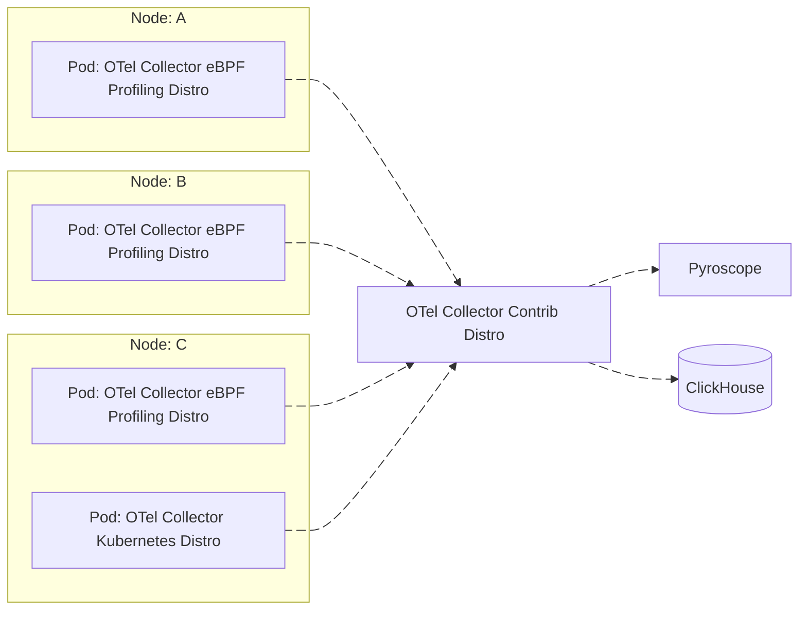
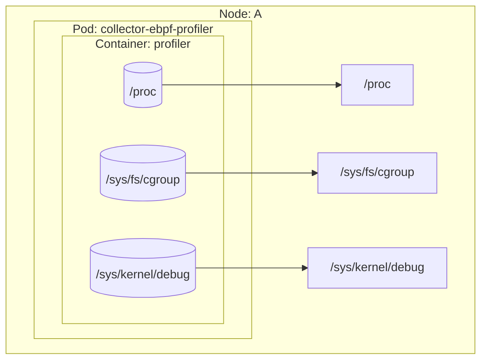

# OpenTelemetry Collector eBPF Profiling Distribution

[](https://github.com/danielpacak/opentelemetry-collector-ebpf-profiler/actions/workflows/docker-publish.yaml)
![Docker Pulls][docker-pulls]

This OpenTelemetry Collector distribution is made specifically to be used as a node agent to gather
profiles on all processes running on the system. It contains the [eBPF profiler receiver] as well as
a subset of components from OpenTelemetry Collector Core and OpenTelemetry Collector Contrib.

> The purpose of this repository is not to replace the official OpenTelemetry Collector eBPF
> Profiling Distribution, but to play with an early, custom distribution until the upstream is
> officially released.

## Quick Start

1. Create a collector configuration file. A very basic configuration may look as follows:

   ``` yaml
   # collector-config.yaml
   receivers:
     profiling:
       Tracers: "perl,php,python,hotspot,ruby,v8,dotnet,go"
       SamplesPerSecond: 20
       BpfVerifierLogLevel: 1
       VerboseMode: true
       SendErrorFrames: false
       OffCPUThreshold: 0
     customprofilesreceiver:
       report_interval: 5s

   processors:
     customprofilesexporter:
       foo: "bar"

   exporters:
     customprofilesexporter:
       ignore_profiles_without_container_id: true
       export_resource_attributes: true
       export_profile_attributes: true
       export_sample_attributes: true
       export_stack_frames: true
       export_stack_frame_types:
         - native
         - kernel
         - go
         - jvm
         - php
         - cpython
       export_function_file: true

   service:
     pipelines:
       profiles:
         receivers:
           - profiling
           - customprofilesreceiver
         processors:
           - customprofilesexporter
         exporters:
           - customprofilesexporter
   ```
2. Create and run collector in a new container from the image that has already been published to the
   Docker Hub container image library:

   ```
   docker run --name collector-ebpf-profiling-distro --privileged --pid=host -it --rm \
     -v /sys/kernel/debug:/sys/kernel/debug \
     -v /sys/fs/cgroup:/sys/fs/cgroup \
     -v /proc:/proc \
     -v $PWD/collector-config.yaml:/etc/config.yaml \
     -p 4317:4317 -p 4318:4318 \
     docker.io/danielpacak/opentelemetry-collector-ebpf-profiler:latest \
       --config=/etc/config.yaml \
       --feature-gates=service.profilesSupport
   ```

## Example Kubernetes Deployments

### Simple

For Kubernetes deployment it's possible to add the [Kubernetes Attributes Processor] to the profiles
pipeline. The processor will enrich profiles with Kubernetes metadata by associating them with pods
through the `container.id` resource attribute.

``` yaml
# collector-config.yaml
receivers:
  profiling:
    Tracers: "perl,php,python,hotspot,ruby,v8,dotnet,go"
    SamplesPerSecond: 20
    BpfVerifierLogLevel: 1
    VerboseMode: true
    SendErrorFrames: false
    OffCPUThreshold: 0

processors:
  k8sattributes:
    wait_for_metadata: true
    wait_for_metadata_timeout: 10s
    auth_type: "serviceAccount"
    passthrough: false
    filter:
      node_from_env_var: KUBERNETES_NODE_NAME
    extract:
      metadata:
        - k8s.cluster.uid
        - k8s.node.name
        - k8s.pod.uid
        - k8s.pod.name
        - k8s.container.name
        - k8s.deployment.name
        - k8s.namespace.name
        - service.namespace
        - service.name
        - service.version
        - service.instance.id
        - container.image.name
        - container.image.tag
        - container.image.repo_digests
      otel_annotations: true
    pod_association:
      - sources:
          - from: resource_attribute
            name: container.id

exporters:
  customprofilesexporter:
    ignore_profiles_without_container_id: true
    export_resource_attributes: true
    export_profile_attributes: true
    export_sample_attributes: true
    export_stack_frames: true
    export_stack_frame_types:
      - native
      - kernel
      - go
      - jvm
      - php
      - cpython

service:
  pipelines:
    profiles:
      receivers:
        - profiling
      processors:
        - k8sattributes
      exporters:
        - customprofilesexporter
```

```
kubectl apply -k example/kubernetes/simple
```

``` console
$ kubectl logs -n node-agent daemonsets/collector-ebpf-profiler
--------------- New Resource Profile --------------
  container.id: cb8ebdde43ea93f184b41d77695ae90411f952e7850c4a37f42408de78b8faa4 (Str)
  k8s.pod.name: kube-apiserver-kube-control-plane (Str)
  service.name: kube-apiserver-kube-control-plane (Str)
  k8s.namespace.name: kube-system (Str)
  service.namespace: kube-system (Str)
  k8s.pod.uid: 2f9000e3-f733-4dfe-917e-c12b1627d186 (Str)
  k8s.node.name: kube-control-plane (Str)
  k8s.cluster.uid: 55383944-1970-45b5-a24e-ae178dc09578 (Str)
  k8s.container.name: kube-apiserver (Str)
  container.image.name: registry.k8s.io/kube-apiserver (Str)
  container.image.tag: v1.32.7 (Str)
  service.instance.id: kube-system.kube-apiserver-kube-control-plane.kube-apiserver (Str)
  service.version: v1.32.7 (Str)
  container.image.repo_digests: ["registry.k8s.io/kube-apiserver@sha256:e04f6223d52f8041c46ef4545ccaf07894b1ca5851506a9142706d4206911f64"] (Slice)
  foo: bar (Str)
------------------- New Profile -------------------
  ProfileID: 00000000000000000000000000000000
  Dropped attributes count: 0
  SampleType: samples
------------------- New Sample --------------------
  thread.name: kube-apiserver (Str)
  process.executable.name: kube-apiserver (Str)
  process.executable.path: /usr/local/bin/kube-apiserver (Str)
  process.pid: 2751 (Int)
  thread.id: 2832 (Int)
---------------------------------------------------
Instrumentation: go, Function: crypto/internal/bigmod.(*Nat).maybeSubtractModulus
Instrumentation: go, Function: crypto/internal/bigmod.(*Nat).montgomeryMul
Instrumentation: go, Function: crypto/internal/bigmod.(*Nat).ExpShortVarTime
Instrumentation: go, Function: crypto/rsa.encrypt
Instrumentation: go, Function: crypto/rsa.VerifyPKCS1v15
Instrumentation: go, Function: gopkg.in/square/go-jose%2ev2.rsaEncrypterVerifier.verifyPayload
Instrumentation: go, Function: gopkg.in/square/go-jose%2ev2.(*rsaEncrypterVerifier).verifyPayload
Instrumentation: go, Function: gopkg.in/square/go-jose%2ev2.JSONWebSignature.DetachedVerify
Instrumentation: go, Function: gopkg.in/square/go-jose%2ev2.JSONWebSignature.Verify-fm
Instrumentation: go, Function: gopkg.in/square/go-jose.v2/jwt.(*JSONWebToken).Claims
Instrumentation: go, Function: k8s.io/kubernetes/pkg/serviceaccount.(*jwtTokenAuthenticator[go.shape.struct { Kubernetes k8s.io/kubernetes/pkg/serviceaccount.kubernetes "json:\"kubernetes.io,omitempty\"" }]).AuthenticateToken
Instrumentation: go, Function: k8s.io/kubernetes/pkg/serviceaccount.(*jwtTokenAuthenticator[k8s.io/kubernetes/pkg/serviceaccount.privateClaims]).AuthenticateToken
Instrumentation: go, Function: k8s.io/apiserver/pkg/authentication/token/union.(*unionAuthTokenHandler).AuthenticateToken
Instrumentation: go, Function: k8s.io/apiserver/pkg/authentication/token/cache.(*cachedTokenAuthenticator).doAuthenticateToken.func1
Instrumentation: go, Function: golang.org/x/sync/singleflight.(*Group).doCall.func2
Instrumentation: go, Function: golang.org/x/sync/singleflight.(*Group).doCall
Instrumentation: go, Function: golang.org/x/sync/singleflight.(*Group).DoChan.gowrap1
Instrumentation: go, Function: runtime.goexit
------------------- End Sample --------------------
------------------- New Sample --------------------
  thread.name: kube-apiserver (Str)
  process.executable.name: kube-apiserver (Str)
  process.executable.path: /usr/local/bin/kube-apiserver (Str)
  process.pid: 2751 (Int)
  thread.id: 2832 (Int)
---------------------------------------------------
Instrumentation: kernel, Function: _raw_spin_unlock_irqrestore
Instrumentation: kernel, Function: __wake_up_sync_key
Instrumentation: kernel, Function: sock_def_readable
Instrumentation: kernel, Function: tcp_data_ready
Instrumentation: kernel, Function: tcp_data_queue
Instrumentation: kernel, Function: tcp_rcv_established
Instrumentation: kernel, Function: tcp_v4_do_rcv
Instrumentation: kernel, Function: tcp_v4_rcv
Instrumentation: kernel, Function: ip_protocol_deliver_rcu
Instrumentation: kernel, Function: ip_local_deliver_finish
Instrumentation: kernel, Function: ip_local_deliver
Instrumentation: kernel, Function: ip_rcv
Instrumentation: kernel, Function: __netif_receive_skb_one_core
Instrumentation: kernel, Function: __netif_receive_skb
Instrumentation: kernel, Function: process_backlog
Instrumentation: kernel, Function: __napi_poll
Instrumentation: kernel, Function: net_rx_action
Instrumentation: kernel, Function: handle_softirqs
Instrumentation: kernel, Function: __do_softirq
Instrumentation: kernel, Function: do_softirq.part.0
Instrumentation: kernel, Function: __local_bh_enable_ip
Instrumentation: kernel, Function: __dev_queue_xmit
Instrumentation: kernel, Function: neigh_hh_output
Instrumentation: kernel, Function: ip_finish_output2
Instrumentation: kernel, Function: __ip_finish_output
Instrumentation: kernel, Function: ip_finish_output
Instrumentation: kernel, Function: ip_output
Instrumentation: kernel, Function: ip_local_out
Instrumentation: kernel, Function: __ip_queue_xmit
Instrumentation: kernel, Function: ip_queue_xmit
Instrumentation: kernel, Function: __tcp_transmit_skb
Instrumentation: kernel, Function: tcp_write_xmit
Instrumentation: kernel, Function: __tcp_push_pending_frames
Instrumentation: kernel, Function: tcp_push
Instrumentation: kernel, Function: tcp_sendmsg_locked
Instrumentation: kernel, Function: tcp_sendmsg
Instrumentation: kernel, Function: inet6_sendmsg
Instrumentation: kernel, Function: sock_write_iter
Instrumentation: kernel, Function: vfs_write
Instrumentation: kernel, Function: ksys_write
Instrumentation: kernel, Function: __x64_sys_write
Instrumentation: kernel, Function: x64_sys_call
Instrumentation: kernel, Function: do_syscall_64
Instrumentation: kernel, Function: entry_SYSCALL_64_after_hwframe
Instrumentation: go, Function: internal/runtime/syscall.Syscall6
Instrumentation: go, Function: syscall.RawSyscall6
Instrumentation: go, Function: syscall.Syscall
Instrumentation: go, Function: syscall.write
Instrumentation: go, Function: internal/poll.(*FD).Write
Instrumentation: go, Function: net.(*netFD).Write
Instrumentation: go, Function: net.(*conn).Write
Instrumentation: go, Function: net.(*TCPConn).Write
Instrumentation: go, Function: crypto/tls.(*Conn).write
Instrumentation: go, Function: crypto/tls.(*Conn).writeRecordLocked
Instrumentation: go, Function: crypto/tls.(*Conn).Write
Instrumentation: go, Function: golang.org/x/net/http2.writeWithByteTimeout
Instrumentation: go, Function: golang.org/x/net/http2.(*bufferedWriterTimeoutWriter).Write
Instrumentation: go, Function: bufio.(*Writer).Flush
Instrumentation: go, Function: golang.org/x/net/http2.(*bufferedWriter).Flush
Instrumentation: go, Function: golang.org/x/net/http2.(*serverConn).Flush
Instrumentation: go, Function: golang.org/x/net/http2.(*flushFrameWriter).writeFrame
Instrumentation: go, Function: golang.org/x/net/http2.(*serverConn).writeFrameAsync
Instrumentation: go, Function: golang.org/x/net/http2.(*serverConn).startFrameWrite.gowrap2
Instrumentation: go, Function: runtime.goexit
------------------- End Sample --------------------
------------------- New Sample --------------------
  thread.name: kube-apiserver (Str)
  process.executable.name: kube-apiserver (Str)
  process.executable.path: /usr/local/bin/kube-apiserver (Str)
  process.pid: 2751 (Int)
  thread.id: 2830 (Int)
---------------------------------------------------
Instrumentation: kernel, Function: ep_poll
Instrumentation: kernel, Function: do_epoll_wait
Instrumentation: kernel, Function: do_epoll_pwait.part.0
Instrumentation: kernel, Function: __x64_sys_epoll_pwait
Instrumentation: kernel, Function: x64_sys_call
Instrumentation: kernel, Function: do_syscall_64
Instrumentation: kernel, Function: entry_SYSCALL_64_after_hwframe
Instrumentation: go, Function: internal/runtime/syscall.Syscall6
Instrumentation: go, Function: internal/runtime/syscall.EpollWait
Instrumentation: go, Function: runtime.netpoll
Instrumentation: go, Function: runtime.findRunnable
Instrumentation: go, Function: runtime.schedule
Instrumentation: go, Function: runtime.park_m
Instrumentation: go, Function: runtime.mcall
------------------- End Sample --------------------
------------------- End Profile -------------------
-------------- End Resource Profile ---------------
```

### Pyroscope

```
kubectl apply -k example/kubernetes/pyroscope
```

```
kubectl port-forward -n pyroscope svc/pyroscope 4040
```






## Example Docker Compose Deployment

```
cd example/docker
docker compose up -d
```

Pyroscope is accessible at http://localhost:4040 and Grafana at http://localhost:3000. Grafana is
provisioned with the Pyroscope datasource so you can either see profiles in Pyroscope web UI or with
Grafana's Pyroscope application.

```
docker compose down
```

---

## Building and Running Locally


1. Install the builder. For linux/amd64 platform you can use the following command:

   ```
   curl --proto '=https' --tlsv1.2 -fL -o ocb \
   https://github.com/open-telemetry/opentelemetry-collector-releases/releases/download/cmd%2Fbuilder%2Fv0.134.0/ocb_0.134.0_linux_amd64
   chmod +x ocb
   ```

2. Generate the code and build Collector's distribution:

   ```
   ./ocb --config manifest.yaml
   ```

3. Containerize Collector’s distribution:
   1. Enable Docker multi-arch builds:
      ```
      docker run --rm --privileged tonistiigi/binfmt --install all
      docker buildx create --name mybuilder --use
      ```
   2. Build the Docker image as Linux AMD or ARM, and load the build result to "docker images":
      ```
      docker buildx build --load \
        -t docker.io/danielpacak/opentelemetry-collector-ebpf-profiler:latest \
        --platform=linux/amd64 .
      ```
      ```
      docker buildx build --load \
        -t docker.io/danielpacak/opentelemetry-collector-ebpf-profiler:latest \
        --platform=linux/arm64 .
      ```
   3. Test the newly-built image:
      ```
      docker run --name collector-ebpf-profiling-distro --privileged --pid=host -it --rm \
        -v /sys/kernel/debug:/sys/kernel/debug \
        -v /sys/fs/cgroup:/sys/fs/cgroup \
        -v /proc:/proc \
        -v $PWD/collector-config.yaml:/etc/config.yaml \
        -p 4317:4317 -p 4318:4318 \
        docker.io/danielpacak/opentelemetry-collector-ebpf-profiler:latest \
          --config=/etc/config.yaml \
          --feature-gates=service.profilesSupport
      ```

## Building and Running on macOS

```
brew install lima
```

```
limactl start --name=collector-ebpf-profiler \
  --vm-type=vz --mount-type=virtiofs \
  --tty=false \
  .lima/template.yaml
```

```
limactl shell collector-ebpf-profiler
```

## Further Reading

1. https://opentelemetry.io/docs/collector/distributions/
2. https://github.com/open-telemetry/opentelemetry-collector-releases/tree/main/distributions/otelcol-ebpf-profiler
3. https://github.com/open-telemetry/opentelemetry-ebpf-profiler/issues/521
4. https://opentelemetry.io/docs/collector/custom-collector/
5. https://blog.jaimyn.dev/how-to-build-multi-architecture-docker-images-on-an-m1-mac/
6. https://github.com/grafana/pyroscope/blob/main/examples/grafana-alloy-auto-instrumentation/ebpf-otel/docker/docker-compose.yml
7. https://github.com/open-telemetry/opentelemetry-collector-contrib/blob/main/processor/k8sattributesprocessor/README.md

[eBPF profiler receiver]: https://github.com/open-telemetry/opentelemetry-ebpf-profiler
[Kubernetes Attributes Processor]: https://github.com/open-telemetry/opentelemetry-collector-contrib/blob/main/processor/k8sattributesprocessor/README.md
[docker-pulls]: https://img.shields.io/docker/pulls/danielpacak/opentelemetry-collector-ebpf-profiler?logo=docker&label=Docker%20Hub%20Pulls
